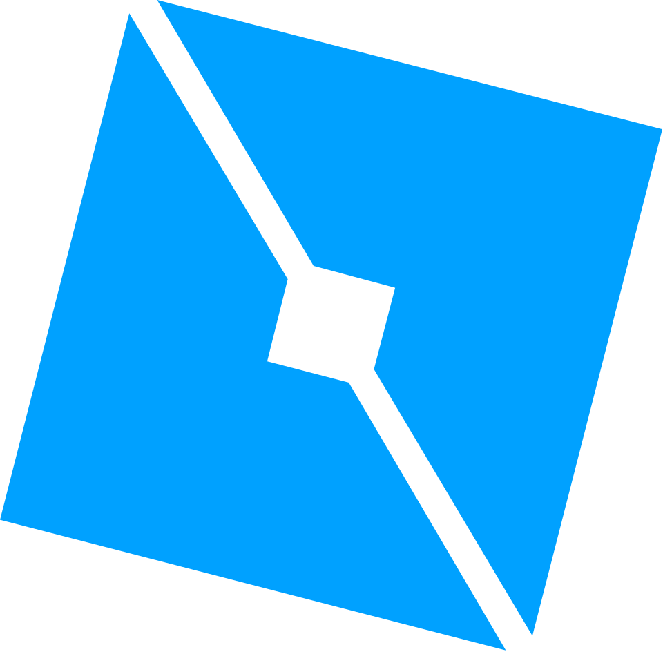

  

###

<h1 data-importer="text" align="center">Hey 👋I'm Zwierzu</h1>

###

<h4 data-importer="text" align="center">Full-Stack Web Developer & Roblox Game Developer</h4>

###

  
  
  
  
  
  
  
  
  
  
  
  
  
  
  
  
  
  
  
  
  
  
  
  
  
  
  
  
  
  
  
  
  
  
  
  
  
  
  
  
  
  
  

###

  
  
  

## 📊 GitHub Stats & Trophies

  
  

  

  

## 🛠️ Languages & Tools

  

 

###

<picture>
  <source media="(prefers-color-scheme: dark)" srcset="https://raw.githubusercontent.com/abozanona/abozanona/output/pacman-contribution-graph-dark.svg">
  <source media="(prefers-color-scheme: light)" srcset="https://raw.githubusercontent.com/abozanona/abozanona/output/pacman-contribution-graph.svg">
  
</picture>

###

  

###

  

###
